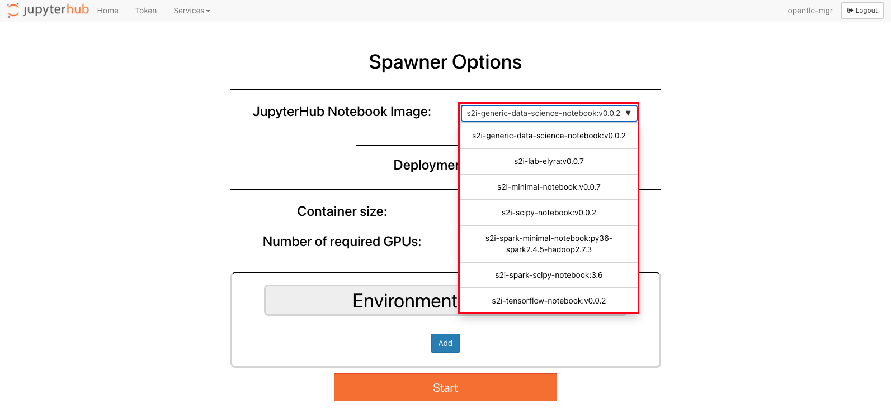
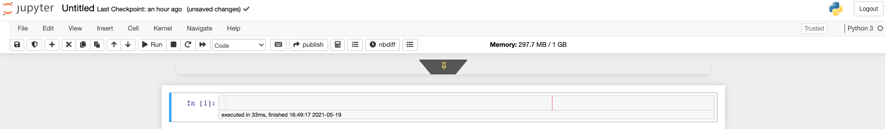
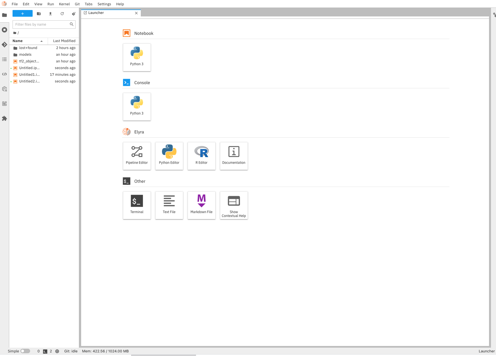
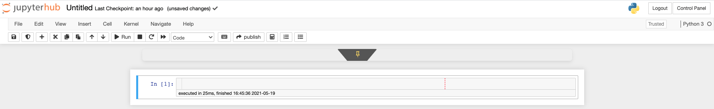
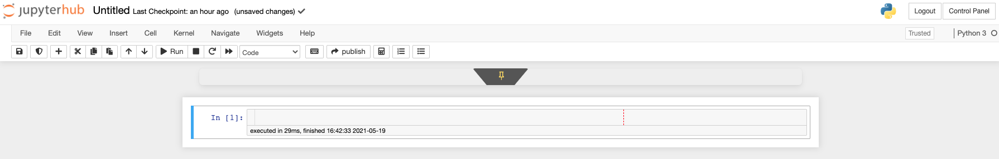
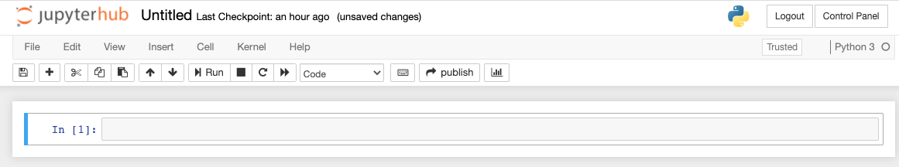
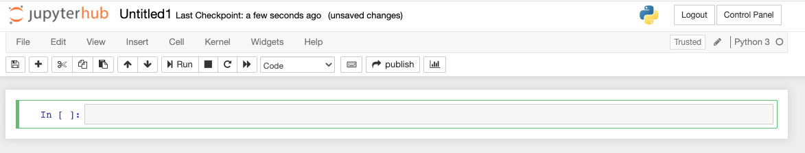
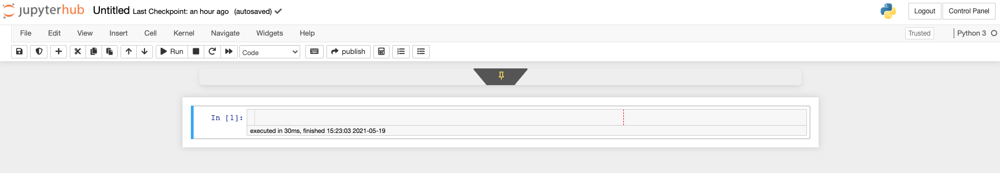

# odh-notebook-deepdive
Review the ODH Jupyter Notebook Images, use cases and how to customize your own.

From the JupyterHub spawner dropdown, you will notice the below notebook images after a default installation of ODH:
|Notebook|Recommended use|
|-|-|
|s2i-generic-data-science-notebook:v0.0.2||
|s2i-lab-elyra:v0.0.7||
|s2i-minimal-notebook:v0.0.7||
|s2i-scipy-notebook:v0.0.2||
|s2i-spark-minimal-notebook:py36-spark2.4.5-hadoop2.7.3||
|s2i-spark-scipy-notebook:3.6||
|s2i-tensorflow-notebook:v0.0.2|Tensorflow|

Each notebook has an available ImageStream and BuildConfig published to github.com/opendatahub-io

## s2i-generic-data-science-notebook 

- UBI8
- Python38

## s2i-lab-elyra

- UBI8
- Python38
- Elyra plugin

## s2i-minimal-notebook

- UBI7
- UBI8
- Python36
- Python38
## s2i-scipy-notebook

- UBI8
- Python36

## s2i-spark-minimal-notebook:py36-spark2.4.5-hadoop2.7.3 

- UBI8
- Python36
- Java
- Hadoop
- Spark

## s2i-spark-scipy-notebook 

- UBI8
- Python36

## s2i-tensorflow-notebook

- UBI8
- Python36
- tensorflow 2
- jupyter-tensorboard

